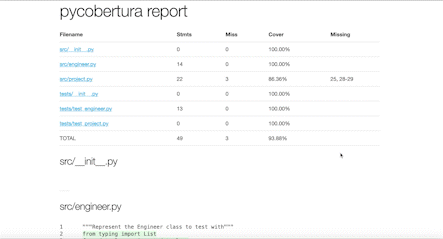

## To showcase python coverage report generation in Azure CI

## Contents of this repo

###  1.) azure-pipeline.yml
Contains a basic setup that installs the dependencies,
runs the tests, generate coverage report and uploads it
as an artifact when a PR is created against the `develop` branch.

###  2.) example_app folder

- html-cob/ folder: empty folder to hold index.html.
  The pipeline needs to have a whole folder not just the index.html
  to be copied into the artifacts.
- src/ folder:
  Holds the example files that describe a fictional engineer
  with projects and income.
- tests/ folder:
  Holds the test files for the src folder files.
- pyproject.toml:
  Basic project configuration, dependencies and poetry tasks.

### 3.) Local usage

Use the project root as your working directory.

Run `poetry shell` to spawn the poetry shell and activate your virtual environment.

Run `poetry install` to install the project dependencies.

Run `poe test-coverage-report-azure` to track tests and code coverage as the azure pipeline would do.
And check out the result first locally.

Some Markdown text with some <em>blue</em> text.

